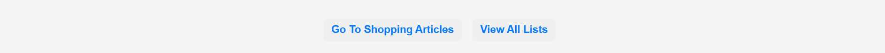
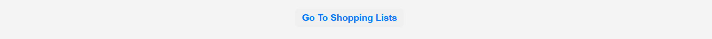
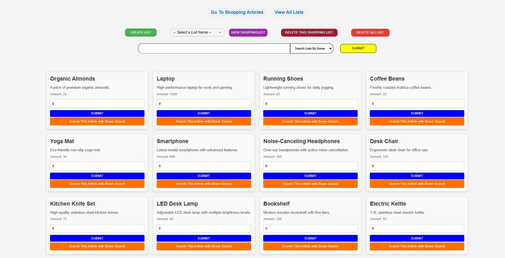
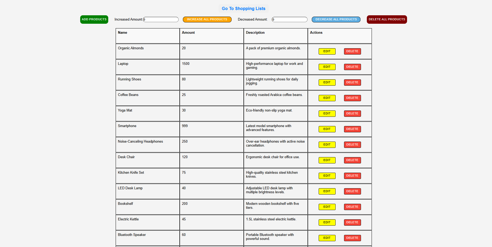
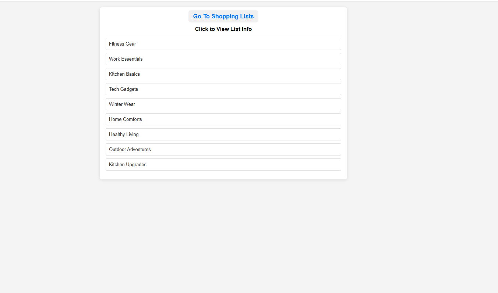

# Frontend Overview

The frontend interacts with the backend, which is developed using **TypeScript**, to access and manipulate data. This integration allows for dynamic and responsive user interactions.
> **Note**  
> The description in the shopping list is optional and can be left empty.
#### Basic Program Code Information

The **`shoppingArticle.tsx`**, **`shoppingList.tsx`**, and **`allList.tsx`** components utilize context providers **`useArticles`** and **`useLists`** from **`articleProvider.tsx`** and **`listProvider.tsx`** to prevent prop drilling and provide easy access to various functions across components.

**A detailed documentation for these context providers can be found under the following links:**

- [useArticles](contextProviderDocs/articleContextProvider.md) **<-- Click Here**
- [useLists](contextProviderDocs/listContextProvider.md) **<-- Click Here**

**A detailed documentation for the functions used in the components for backend endpoint calls:**

- [Function used for Shopping Articles](functionInComponentDocs/articlesFunction.md) **<-- Click Here**
- [Function used for Shopping Lists](functionInComponentDocs/listFunction.md) **<-- Click Here**

**A detailed documentation for the useEffect hooks used in the components for backend endpoint calls:**

- [useEffect hooks used for Shopping Article](useEffectHooksDocs/articles.md) **<-- Click Here**
- [useEffect hooks used for Shopping List](useEffectHooksDocs/list.md)**<-- Click Here**
- [useEffect hooks used for List View](useEffectHooksDocs/listView.md)**<-- Click Here**

### Page Routes

There are **4 routes** developed using **React Router DOM**:
1. **Go To Shopping List** – to view the shopping list.
2. **Go To Shopping Articles** – to view the available shopping articles.
3. **View All Lists** – to view all the available lists.
4. **List Details** – to view the details of a specific shopping list.

### Router Configuration

The **`Router`** component is the parent component, wrapping the entire routing configuration, and it controls the routing mechanism for the application.

#### **`Routes`** and **`Route`** Setup

- **`<Route path="/" element={<ShoppingList />} />`**  
  - This route maps to the **ShoppingList** component when the user navigates to the root (`/`) of the application. This will display the shopping list page.

- **`<Route path="/shoppingArticles" element={<ShoppingArticles />} />`**  
  - This route maps to the **ShoppingArticles** component when the user navigates to `/shoppingArticles`. This page will display available shopping articles.

- **`<Route path="/all-lists" element={<AllList />} />`**  
  - This route maps to the **AllList** component when the user navigates to `/all-lists`. This page will display all the available lists.

- **`<Route path="/details/:name" element={<ListDetails />} />`**  
  - This route is dynamic and maps to the **ListDetails** component when the user navigates to `/details/:name`. The `:name` is a dynamic parameter that will be passed to the **ListDetails** component. This page displays the details of a specific list based on the provided name in the URL.

Below are some key UI screenshots along with links to the corresponding documentation. These links provide a deeper understanding of each page's functionality and design:

### Page Load

Upon page load, the articles are fetched from the backend, which is programmed using **TypeScript**, and displayed on the frontend.

---

### Shopping List Page (Home Page)
[📖 View Documentation for Shopping List Page](shoppingListDocs/README.md)  

---

### Shopping Article Page
[📖 View Documentation for Shopping Article Page](shoppingArticleDocs/README.md)  

---

### View All Lists
[📖 View Documentation for View All Lists](allListDocs/README.md)  

---

For further details on each page’s functionality, follow the documentation links above.
