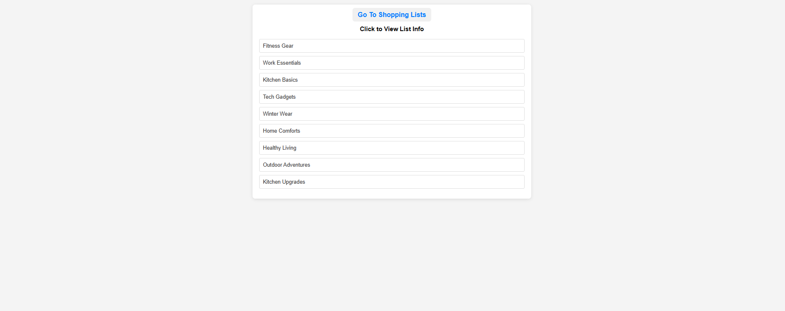

# Frontend Overview — All List

All the code for the **All List** starts from `src/allLst/allList.tsx`. This file contains the `AllList` component, which is responsible for displaying all the available list names. Each list name is rendered as a link using `Link` from `react-router-dom`, navigating to the `listDetails.tsx` component when clicked. The `listDetails.tsx` component displays the details of the selected list.

The `AllList` component retrieves the current lists using the `useLists` hook. It dynamically generates a `Link` for each list name, allowing seamless navigation to the `listDetails` component located in `src/details/listDetails.tsx`.

When the `listDetails` component is called, it triggers the `useEffect` hook to fetch the data from the backend. The requested list name is captured using `useParams`, which captures the selected name and implements it in the `useEffect` hook. Once the results are available, the child component `SearchResultTable` is used to display the details of the list.
