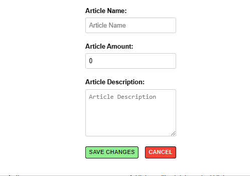
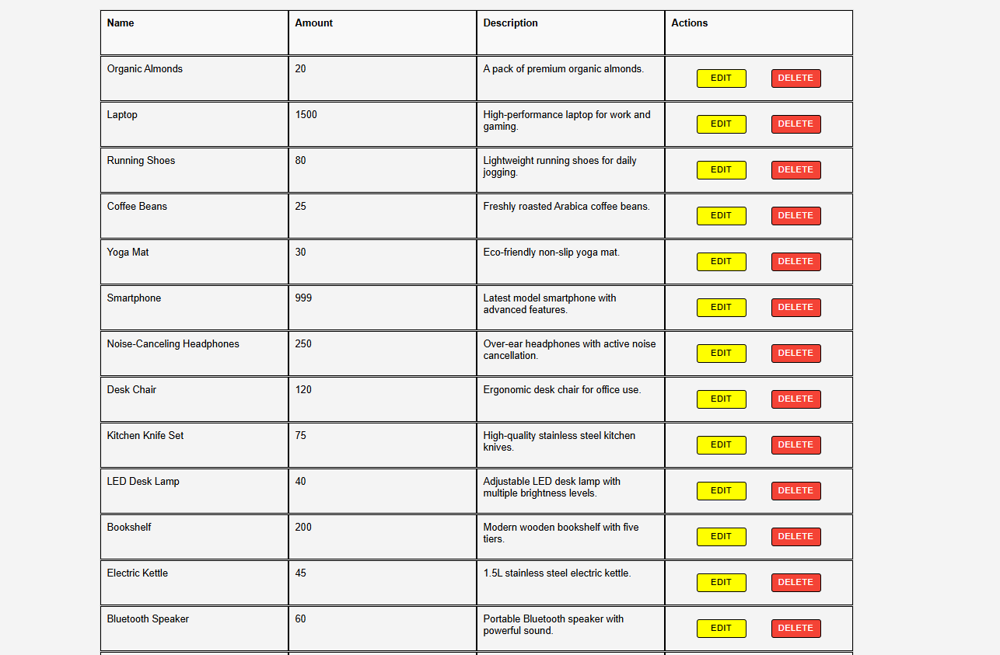
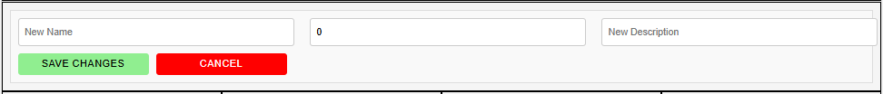

# Frontend Overview -- Shopping Article

All the code for the **Shopping Article** starts from `src/shoppingArticles.tsx`. This file contains two main child components: the **Article Component** and the **Header Component**.

### Shopping Article Header (**View Component**)  

### Header Component  
The **Header Component** is responsible for the following functionalities:

1. **Increasing or Decreasing the Quantity of Articles:**  
   - **Implementation (Increase All Products):**  
     The **Increase All Products** button increments the quantity of all articles by a specified amount.  
     - The **Header Component** includes a child component called **`IncreaseForm`**.  
     - Within **`IncreaseForm`**, the function **`handleIncreaseAllProducts`** is triggered when the button is clicked.  
     - This function fetches the corresponding API endpoint to retrieve the updated article data. Once completed successfully, it updates the articles' quantities in the frontend using the **`updateArticles`** method.  

   - **Implementation (Decrease All Products):**  
     The **Decrease All Products** button decrements the quantity of all articles.  
     - This is implemented using the child component **`DecreaseForm`**.  
     - When the button is clicked, it calls the **`handleDecreaseAllProducts`** function, which triggers the corresponding API. Upon successful completion, it updates the articles' quantities in the frontend using the **`updateArticles`** method.  

2. **Adding a New Article:**

   - **Implementation:**  
      - When the **Add Products** button is clicked, it sets the `setArticleWindow` state to `true`, triggering the child component **`AddArticles`** to be displayed.  
      - The **`AddArticles`** component contains a form where users can enter the details of the article they want to add.  
      - Upon submission, the form sends a request to the corresponding backend endpoint.  
      - Once the backend returns a successful response, the article is added to the `articles` array in the frontend using the **`addNewArticles`** function.  
   

3. **Deleting All Articles:**  
   - **Implementation:**
      - When the **Delete All Products** button is clicked, it triggers the function **`handleDeleteAllProducts`**, which sends a request to the corresponding backend endpoint.  
      - Upon receiving a successful response from the backend, the data is deleted from the backend database.  
      - The frontend is updated to reflect these changes by using the **`deleteAllArticles()`** function.  

### Shopping Article View(Article Component)

The **Article Component** is responsible for the following functionalities:

1. **Displaying the Name and Quantity of the Article**
   - **Implementation:**
      - The article component located in `shopping/article.tsx` displays all the articles from the `useArticles` context provider.
      - The `Articles` component presents the results in a div-table-like structure. It also provides the possibility of deletion.
      
2. **Providing functionality to delete the article.** 
   - **Implementation:**
      - Deletion is achieved by clicking the **Delete** button, which triggers the `deleteArticles` function. This function takes the corresponding article name as input and calls the corresponding backend endpoint to implement the changes. 
      - Once the changes are successful, the frontend is updated using the `updateDeleteArticles` function from useArticles Context provider.

3. **Providing Functionality to Edit the Name, Description, and Adjust the Quantity of an Article**  

This functionality is achieved using the **Edit** button, which, when clicked, triggers the `setEditArticles` useState hook to `true`. Once set to `true`, it enables the use of the child component `EditView`. The `EditView` component provides the following features:

   - **Implementation:**
      - **Edit Name:**  
        This is achieved when the user enters the new name in the input field and clicks on the **Edit** button. When the button is clicked, the form is submitted, triggering the `handleEdit` function.  
        - The `handleEdit` function calls the `handleNameUpdate` function, which communicates with the corresponding API endpoint to update the necessary changes in the backend.  
        - After the API call succeeds, the `editNameOfArticles` function is invoked to reflect the changes on the frontend.  

      - **Edit Description:**  
        This is achieved when the user enters the new descrition in the input field and clicks on the **Edit** button. When the button is clicked, the form is submitted, triggering the `handleEdit` function.  
        - The `handleEdit` function calls the `handleDescriptionUpdate` function, which communicates with the corresponding API endpoint to update the necessary changes in the backend.  
        - After the API call succeeds, the ` editDescriptionOfArticles` function is invoked to reflect the changes on the frontend.  

      - **Adjust Quantity:**  
        This is achieved when the user enters the new Quantity in the input field and clicks on the **Edit** button. When the button is clicked, the form is submitted, triggering the `handleEdit` function.  
        - The `handleEdit` function calls the `handleAmountUpdate` function, which communicates with the corresponding API endpoint to update the necessary changes in the backend.  
        - After the API call succeeds, the ` editAmountOfArticles` function is invoked to reflect the changes on the frontend.
   
   The form can update from 1 to 3 different requests at a time (i.e., name change, description change and amount update).
