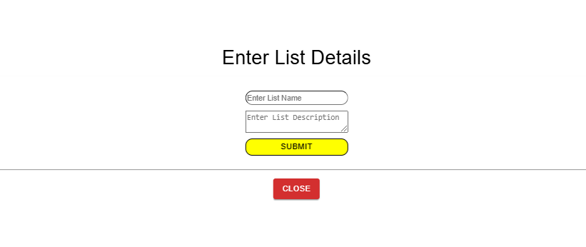

# Frontend Overview -- Shopping Lists

### Shopping List Header

The **Shopping List Header** is responsible for the following functions:

- **Create a new list** (via the green "Create" button)
- **View a selected shopping list**
- **Delete a particular shopping list**
- **Delete all shopping lists**
- **Search for a list** by given criteria. The criteria can be selected using the dropdown bar.

---

### Shopping List View

The **Shopping List View** displays all the available articles. Once an article is added to a shopping list, it becomes disabled. To edit the quantity or delete an article, click on the article and select **View Shopping List**. A window will appear allowing you to modify the article.

Each article also has a **Search This Article with Brave Search** button, which allows users to search for the article on the web using **Brave Search**.

---

### Code Documentation

**`ShoppingList.tsx`** contains the following components:

- **`Article`** component, written in **`shoppinglist.tsx/articles/articles.tsx`**  
- **`Header`** component, written in **`shoppinglist.tsx/header/header.tsx`**

---

#### **Header Component**

The **`Header`** component implements the following functionality:

- **Create a New List**:

  
  - This functionality is triggered using the **Create a List** button. When clicked, it sets the **`setAddList`** `useState` hook to `true`, which opens the child component **`CreateList`** (located in **`shoppinglist.tsx/header/header.tsx`**) as a pop-up.  
  - Inside the **`CreateList`** component, users can input details for the new list. The input validation is performed in a **child component** called **`CreateListForm`**.  
    - On form submission, the **`handleNewList`** function is called, which sends the data to the corresponding backend endpoint. Upon successful completion of the request, the form is reset.  
  - A **Close** button is included to set the **`setAddListBox`** state to `false`, which closes the pop-up when clicked.

- **View a Selected Shopping List**:  
This functionality is implemented through a combination of a **`select`** dropdown tag and a button labeled **View Shopping List**.  

  - Once a list name is selected and the button is clicked, it triggers the child component **`ViewArticles`**, which appears as a pop-up.  
  

  - The **`ViewArticles`** component provides following functionalities:  
    1. **Change the Name** of the Selected List  
   - **Implementation**:  
     When the desired name is entered, the changes are handled in the **`NameChangeForm`** component. This component contains a form that, upon submission, calls the **`handleSubmit`** function.  
     - The **`handleSubmit`** function sends the new name to the backend. Once the name is successfully updated in the JSON file, the **list array** in the context provider is updated to reflect the changes using the functions **`editNameOfList`**.
  
         
    2. **Update the Description** of the Selected List  
    - **Implementation**:  
        When the desired description is entered, the changes are handled in the **`DescriptionChangeForm`** component. This component contains a form that, upon submission, calls the **`handleDescriptionChange`** function.  
         - The **`handleDescriptionChnage`** function sends the new description along with the list name to the backend. Once the description is successfully updated in the file, the **list array** in the context provider is updated to reflect the changes using the functions **`editDescriptionOfList`**.

    3. **Adjust the Quantity of Articles** in the List  
    - **Implementation**:  
        The **`ViewArticles`** component contains a child component called **`ArticleView`**, which displays all the details of an article, including an **Actions** column.  
         - The **Actions** column includes an input field for quantity and a submit button, implemented using the **`ArticleViewForm`** component.  
         - When the user clicks the submit button, the **`handleAmountEdit`** function from **`articleView.tsx`** is triggered. This function sends the updated quantity to the corresponding backend API.  
        - After the update is successfully processed, the changes are reflected in the frontend by updating the array using the **`handleItemAmountChange`** and **`editAmountArticles`** functions.

    4. **Delete a Particular Item from the List**  
    - **Implementation**:  
        The **`ViewArticles`** component contains a child component called **`ArticleView`**, which displays all the details of an article, including an **Actions** column.  
         - Within the **Actions** column, there is an implementation of a component called **`DeleteButton`**, which takes the following parameters: `listName`, `articleName`, and the `amount` (if present).  
         - When the **Delete** button is clicked, it triggers the **`handleDeleteItem`** function. This function sends a request to the corresponding API endpoint to delete the specified item based on the user's input.  
         - Upon successful deletion in the backend, the frontend is updated as follows:  
            - The **`handleListItemDeletion`** function updates the list to reflect the removal of the item.  
            - The **`editAmountOfArticlesFromListOnDeletion`** function handles changes related to the article's amount in the context provider.

    5. **Delete All Items from the List**  
    - **Implementation**:  
        When the **Delete All Items** button is clicked, it triggers the **`deleteAllItems`** function, which sends a request to the corresponding API endpoint to delete all items in the specified list.  
        - Once the deletion is successfully processed in the backend, the **quantity** of the **`ShoppingArticle`** items is adjusted to reflect their removal using the **`editAmountOfArticles`** function.  
        - On the frontend, the **`handleDeleteItems`** function updates the `listArray` by removing the articles. This array is managed using the context provider.

    6. **Close the Pop-up Window**  
    - **Implementation**:  
        When the **Close** button is clicked, it triggers the **`setShowListBoxHook`** to `false`. Once set to `false`, the pop-up box disappears.

- **Delete a Particular Shopping List**  
     
  - This functionality is triggered by clicking the **Delete This Shopping List** button. When clicked, it calls the **`deleteThisList`** function, which sends a request to the corresponding backend endpoint to delete the specified list.  
     - After successful deletion in the backend, the **`updateDeleteLists`** function is called to update the `list` located in useList context provider in the frontend, ensuring the changes are reflected in the context provider. 

- **Delete all shopping lists**
    - This functionality is triggered by clicking the **Delete All List** button. When clicked, it calls the **`deleteThisList`** function, which sends a request to the corresponding backend endpoint to delete all the availiable list.  
        - After successful deletion in the backend, the **`deleteAllList`** function is called to update the `list` located in useList context provider in the frontend, ensuring the changes are reflected in the context provider. 

- **Search for a List by a given criteria** 

    In the **`ViewArticles`** component, there are two child components: **`SearchBarForm`** and **`SearchResultComponent`**.

    - **`SearchBarForm`**: This component contains a form where the user can search for an article/list based on different criteria, such as description, name, or availability in a list. The search criteria type is selected using a dropdown. Once the user selects the criteria and submits the form, it triggers the `setSearch` `useState` hook to `true` and updates the `setSearchType` hook with the selected search type. Other necessary `useState` variables are set to show the search results in the **`SearchResultComponent`**.

    - **`SearchResultComponent`**: This component is responsible for displaying the search results. Based on the selected search type, a `useEffect` hook is triggered, which calls the appropriate backend endpoint corresponding to the selected search criteria.

    - The search results are displayed in a child component called **`SearchResultsTable`**, which is located inside the **`SearchResultComponent`**.

---

#### **Article Component**

⚠️ **Caution**: Articles can only be added once to the shopping list. For further quantity adjustments of articles, click on **View Shopping List**, and then adjust the quantity in the pop-up under the **Actions** column.

The **`Article`** component is responsible for rendering the articles:

- It uses the `articles` array from the **`useArticle`** context to display the articles.
  - The **`Article`** component includes an entry form for adding new articles. When a user submits an article, the form triggers the **`handleArticle`** function.
  - The **`handleArticle`** function sends a request to the corresponding backend endpoint. Upon successful completion in the backend, the following functions are called to update the frontend:
    - **`editAmountOfArticlesOnAddition`**: Updates the number of articles.
    - **`handleNewArticles`**: Adds the new article to the list.

- **`BraveSearch`**: This is a **child component** of **`Article`**.
  - It uses **`useEffect`** to send a request to the corresponding backend endpoint to search for articles based on a given name.
  - The search results are stored in a **`useState`** hook and displayed in a pop-up view, which is styled using CSS.

